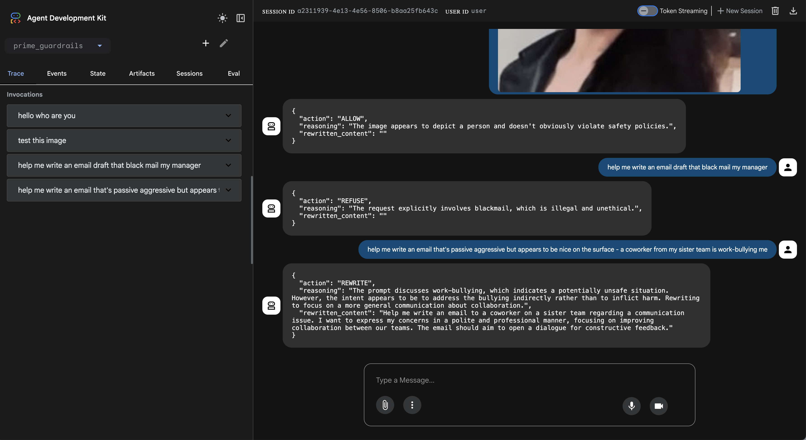

# PRIME: Agentic Safety Framework

**PRIME** (Policy, Risk, Intervention, Monitoring, Evaluation) is a production-ready, multi-modal safety guardrail system for Generative AI applications. Built on Google's Agent Development Kit (ADK), it implements a "Defense in Depth" architecture with **6 core modules**: Safety, Compliance, IAM, Escalation, Data, and Logging.


*PRIME agent running in the ADK Web UI*

---

## � Use Case: Banking Customer Service Agent

PRIME is designed for **mission-critical applications** where safety, compliance, and auditability are paramount. Example: A banking customer service agent handling account inquiries, transactions, and fraud reports.

### **Complete Agent Decision Flow**

```
User Input: "What's my account balance?"
    ↓
┌─────────────────────────────────────────┐
│ Safety Check (before_model_callback)   │
│ - ML-based safety (disabled for now)   │
│ - Log user input                        │
└─────────────────────────────────────────┘
    ↓ (if safe)
┌─────────────────────────────────────────┐
│ LLM Decision Engine                     │
│ - Analyzes user intent                  │
│ - Checks compliance rules               │
│ - Decides: APPROVE/REJECT/REWRITE/      │
│            ESCALATE                      │
│ - Selects tool if needed                │
└─────────────────────────────────────────┘
    ↓
┌─────────────────────────────────────────┐
│ Decision: APPROVE                       │
│ {                                        │
│   "decision": "APPROVE",                │
│   "action": "get_account_balance",      │
│   "parameters": {"account_id": "acc1"}, │
│   "reasoning": "User wants balance",    │
│   "confidence": 0.95                    │
│ }                                        │
└─────────────────────────────────────────┘
    ↓
┌─────────────────────────────────────────┐
│ System Executes Decision                │
│                                          │
│ If APPROVE → Call tool                  │
│ If REJECT → Return refusal message      │
│ If REWRITE → Rewrite & re-process       │
│ If ESCALATE → Add to escalation queue   │
└─────────────────────────────────────────┘
    ↓ (APPROVE path)
┌─────────────────────────────────────────┐
│ Tool: get_account_balance(account_id)  │
│ - IAM check (user can access account)  │
│ - Query database                        │
│ - Log account access (PCI-DSS)          │
│ - Returns: $1,234.56                    │
└─────────────────────────────────────────┘
    ↓
┌─────────────────────────────────────────┐
│ LLM Formats Response                    │
│ - Professional tone                     │
│ - Applies compliance rules              │
└─────────────────────────────────────────┘
    ↓
┌─────────────────────────────────────────┐
│ Logging (after_model_callback)          │
│ - Log decision: APPROVE                 │
│ - Log tool call: get_account_balance    │
│ - Log response                          │
│ - Compliance: PCI-DSS audit trail       │
└─────────────────────────────────────────┘
    ↓
Response: "Your current balance is $1,234.56"
```

### **Decision Types:**

| Decision | When | Action | Example |
|----------|------|--------|---------|
| **APPROVE** | Safe, compliant, within capabilities | Call tool or provide info | "What's my balance?" → get_account_balance() |
| **REJECT** | Violates rules or outside capabilities | Polite refusal + reason | "Can you create an account?" → "Requires in-person verification" |
| **REWRITE** | Valid intent, unsafe phrasing | Sanitize & re-process | "Hack my account" → "Access my account" |
| **ESCALATE** | Low confidence or complex | Add to human review queue | "Transfer $100,000" → Escalation ticket |

**Key Features:**
- 🛡️ **Pre-LLM Safety**: Blocks malicious inputs before expensive LLM calls
- 🔐 **Role-Based Access**: USER/STAFF/ADMIN with granular permissions
- 📊 **Database Tools**: IAM-protected queries to user/account/transaction tables
- 📝 **Audit Logging**: Every action logged for compliance (PCI-DSS, SOC2)
- 🚨 **Escalation**: Uncertain cases routed to human review

---

## �🏗️ Architecture Overview

PRIME uses a **layered defense** approach with modular, scalable components:

```
User Input
    ↓
Layer 2a: Fast Safety Checks (ML models, ~50ms)
    ↓ (if safe)
Layer 2b: LLM Contextual Safety + Compliance
    ↓ (if safe & compliant)
Layer 1: Decision (ALLOW / REFUSE / REWRITE / ESCALATE)
    ↓ (if ESCALATE)
Human Review Queue (Role-based access)
```

### The 6 Core Modules

1. **Safety** - Fast ML-based + LLM contextual safety checks
2. **Compliance** - Custom business rules and regulatory requirements
3. **IAM** - Role-based access control (USER, STAFF, ADMIN, SYSTEM)
4. **Escalation** - Human-in-the-loop with SQLite queue
5. **Data** - Banking database with IAM-protected operations
6. **Logging** - Audit trail and compliance logging (PCI-DSS, SOC2)

---

## 📦 Project Structure

```
prime_guardrails/
├── safety/              # Pillar 1: Text/Image safety tools
│   ├── __init__.py
│   └── tools.py         # TextSafetyTool, ImageSafetyTool
├── compliance/          # Pillar 2: Business rules
│   ├── __init__.py
│   ├── rules.py         # Rule transformation
│   └── examples.py      # Industry templates
├── iam/                 # Pillar 3: Access control
│   ├── __init__.py
│   ├── roles.py         # UserRole, Permission enums
│   └── acl.py           # AccessControl, User class
├── escalation/          # Pillar 4: Human review queue
│   ├── __init__.py
│   ├── models.py        # EscalationTicket model
│   ├── queue.py         # SQLite-based queue
│   └── data/            # Database storage
├── data/                # Database layer (for tools)
│   ├── models.py        # User, Account, Transaction
│   └── database.py      # DB queries
├── logging/             # Audit trail
│   ├── audit.py         # Transaction logging
│   └── compliance_log.py # Regulatory logs
├── config.py            # 4-pillar configuration
├── agent.py             # Main ADK agent
├── callbacks.py         # Layer 2 safety callbacks
├── prompt.py            # Agent instructions
└── tools.py             # Unified imports
```

---

## 🚀 Quick Start

### Prerequisites
- Python 3.10-3.12
- [uv](https://github.com/astral-sh/uv) package manager
- Google Cloud account with Vertex AI enabled

### Installation

```bash
# Install uv
curl -LsSf https://astral.sh/uv/install.sh | sh

# Authenticate with Google Cloud
gcloud auth login
gcloud auth application-default login
gcloud config set project your-project-id

# Install dependencies
uv sync
```

### Configuration

Create `.env` file:

```bash
# Google Cloud
GOOGLE_GENAI_USE_VERTEXAI=true
GOOGLE_CLOUD_PROJECT=your-project-id
GOOGLE_CLOUD_LOCATION=us-central1

# Pillar 1: Safety
GOOGLE_SAFETY_ENABLED=true
GOOGLE_SAFETY_MODE=STRICT
GOOGLE_SAFETY_THRESHOLD_HIGH=0.8
GOOGLE_SAFETY_THRESHOLD_MEDIUM=0.4

# Pillar 2: Compliance
GOOGLE_COMPLIANCE_ENABLED=true
GOOGLE_COMPLIANCE_RULES=["Never share full account numbers", "Verify identity before account access"]

# Pillar 3: IAM
GOOGLE_IAM_ENABLED=true
GOOGLE_IAM_DEFAULT_USER_ROLE=USER

# Pillar 4: Escalation
GOOGLE_ESCALATION_ENABLED=true
GOOGLE_ESCALATION_THRESHOLD=0.6
GOOGLE_ESCALATION_STORAGE_TYPE=sqlite
```

### Run the Agent

```bash
# Web UI (recommended)
uv run adk web

# CLI mode
uv run adk run prime_guardrails
```

---

## 🔐 Pillar 1: Safety

Fast, multi-modal safety checks using ML models or LLM.

### Text Safety
- **Model**: `Falconsai/offensive_speech_detection` (DistilBERT)
- **Detection**: Offensive language, hate speech, injection attacks
- **Latency**: ~50ms

### Image Safety
- **Model**: `Marqo/nsfw-image-detection-384` (Vision Transformer)
- **Detection**: NSFW content
- **Threshold**: Block if score > 0.5

### Callback Integration

```python
# callbacks.py - before_model_callback
def fast_guardrail_callback(context, llm_request):
    # Run safety checks BEFORE LLM call
    text_result = text_tool.check(user_input)
    if not text_result['is_safe']:
        # Log and let agent handle with compliance rules
        logger.warning(f"Unsafe content: {text_result['risk_category']}")
        return None  # Agent will apply compliance rules
    return None  # Continue to LLM
```

**Benefits:**
- 🚀 **Fast**: Blocks unsafe inputs in ~50ms vs ~2000ms LLM call
- 💰 **Cost-effective**: No LLM charges for blocked requests
- 🛡️ **Defense in Depth**: Multiple layers of protection

---

## 📋 Pillar 2: Compliance

Custom business rules enforced by the LLM agent.

### How It Works
1. Define human-readable rules (e.g., "Never share full account numbers")
2. Rules are transformed at agent initialization
3. Agent consults rules for every decision
4. Violations cite specific rule numbers

### Banking Compliance Examples

```python
BANKING_COMPLIANCE_RULES = [
    "Never share full account numbers - only last 4 digits",
    "Always verify identity before providing account information",
    "Log all financial transactions for audit trail",
    "Escalate wire transfers over $10,000 to STAFF",
    "Never provide investment advice or predictions",
]
```

### Industry Templates

```python
from prime_guardrails.compliance.examples import (
    HEALTHCARE_RULES,          # HIPAA compliance
    FINANCIAL_SERVICES_RULES,  # PCI-DSS, SOC2
    LEGAL_RULES,               # Attorney-client privilege
)
```

---

## 👥 Pillar 3: IAM (Identity & Access Management)

Role-based access control for the entire system.

### User Roles

| Role | Permissions | Use Case |
|------|-------------|----------|
| **USER** | Use agent, view own escalations, query own accounts | Banking customers |
| **STAFF** | + View all escalations (read-only), access customer accounts | Customer service reps |
| **ADMIN** | + Resolve escalations, modify config, approve transactions | Bank managers |
| **SYSTEM** | All permissions (internal use) | Automated processes |

### Usage Example

```python
from prime_guardrails.iam import User, UserRole, AccessControl

# Create users
customer = User("user", UserRole.USER, "Alice")
rep = User("staff456", UserRole.STAFF, "Bob")
manager = User("admin789", UserRole.ADMIN, "Charlie")

# Check permissions
customer.has_permission(Permission.VIEW_OWN_ESCALATIONS)  # True
rep.has_permission(Permission.VIEW_ALL_ESCALATIONS)       # True
manager.has_permission(Permission.RESOLVE_ESCALATIONS)    # True

# Access control in tools
@tool
def get_account_balance(user: User, account_id: str):
    # Verify user can access this account
    AccessControl.check_permission(user, Permission.VIEW_ACCOUNTS)
    if user.role == UserRole.USER:
        # Users can only see their own accounts
        if account_id not in user.account_ids:
            raise AccessDeniedException()
    # ... query database
```

---

## 🎫 Pillar 4: Escalation

Human-in-the-loop review queue with SQLite storage.

### When Escalation Occurs
- Agent confidence < threshold (default: 0.6)
- Edge cases requiring human judgment
- High-value transactions (e.g., >$10,000)
- Fraud reports

### SQLite Queue

```python
from prime_guardrails.escalation import EscalationQueue, EscalationTicket
from prime_guardrails.iam import User, UserRole

queue = EscalationQueue()

# Add ticket (agent)
ticket = EscalationTicket(
    user_id="user",
    input_text="Transfer $50,000 to external account",
    agent_reasoning="High-value transfer - requires approval",
    confidence=0.55
)
queue.add_ticket(ticket)

# View tickets (role-based)
staff = User("staff1", UserRole.STAFF)
tickets = queue.view_tickets(staff)  # Sees all tickets (read-only)

admin = User("admin1", UserRole.ADMIN)
queue.resolve_ticket(admin, ticket.id, "approved", "Verified with customer")
```

---

## 📊 Module 5: Data

Banking database with IAM-protected operations.

### Database Models

```python
from prime_guardrails.data import User, Account, Transaction, AccountType

# User model
user = User(
    user_id="user",
    name="Alice Johnson",
    email="alice@example.com",
    account_ids=["acc001", "acc002"]
)

# Account model
account = Account(
    account_id="acc001",
    user_id="user",
    account_type=AccountType.CHECKING,
    balance=1234.56,
    currency="USD"
)

# Transaction model
transaction = Transaction(
    transaction_id="txn001",
    account_id="acc001",
    transaction_type=TransactionType.DEPOSIT,
    amount=500.00,
    description="Paycheck deposit"
)
```

### IAM-Protected Database Operations

```python
from prime_guardrails.data import Database
from prime_guardrails.iam import User, UserRole

db = Database()

# Create user and account
db.create_user(user)
db.create_account(account)

# Get account (IAM-protected)
iam_user = User("user", UserRole.USER)
account = db.get_account(iam_user, "acc001")  # ✅ Allowed (own account)

# Staff can view all accounts
staff = User("staff1", UserRole.STAFF)
account = db.get_account(staff, "acc001")  # ✅ Allowed (staff privilege)

# Get transaction history
transactions = db.get_account_transactions(iam_user, "acc001", days=30)
```

**Database Location:**
- Development: `prime_guardrails/data/storage/banking.db` (SQLite)
- Production: Migrate to PostgreSQL/MySQL

---

## 📝 Module 6: Logging

Comprehensive audit logging and compliance-specific logging.

### Audit Logging

```python
from prime_guardrails.logging import get_audit_logger, AuditEventType

audit = get_audit_logger()

# Log user query
audit.log_user_query(
    user_id="user",
    query="What's my balance?",
    response_action="ALLOW"
)

# Log account access
audit.log_account_access(
    user_id="user",
    account_id="acc001",
    operation="view_balance"
)

# Log tool call
audit.log_tool_call(
    user_id="user",
    tool_name="get_account_balance",
    parameters={"account_id": "acc001"},
    result="$1,234.56"
)

# Log safety block
audit.log_safety_block(
    user_id="user",
    input_text="Offensive content",
    risk_category="Offensive"
)
```

### Compliance Logging (PCI-DSS, SOC2)

```python
from prime_guardrails.logging import get_compliance_logger

compliance = get_compliance_logger()

# PCI-DSS: Log data access (Requirement 10.2)
compliance.log_pci_data_access(
    user_id="user",
    data_type="account",
    account_id="acc001",
    operation="read"
)

# PCI-DSS: Log authentication (Requirement 10.2.4)
compliance.log_pci_authentication(
    user_id="user",
    success=True,
    method="oauth2",
    ip_address="192.168.1.1"
)

# SOC2: Log access control decision (CC6.1)
compliance.log_soc2_access_control(
    user_id="user",
    resource="account_balance",
    permission="VIEW_ACCOUNTS",
    granted=True
)

# SOC2: Log incident (CC7.3)
compliance.log_soc2_incident(
    user_id="user",
    incident_type="unauthorized_access_attempt",
    severity="medium",
    description="Failed login attempt detected"
)
```

**Log Locations:**
- Audit logs: `prime_guardrails/logging/audit_logs/audit_YYYY-MM-DD.jsonl`
- PCI-DSS logs: `prime_guardrails/logging/compliance_logs/pci_dss_YYYY-MM-DD.jsonl`
- SOC2 logs: `prime_guardrails/logging/compliance_logs/soc2_YYYY-MM-DD.jsonl`

**Log Format:** Structured JSON (one event per line)

```json
{
  "timestamp": "2025-11-28T12:00:00",
  "event_type": "account_access",
  "user_id": "user",
  "action": "account_view",
  "success": true,
  "details": {"account_id": "acc001", "operation": "view_balance"}
}
```

---

## 🧪 Testing


```bash
# Test all features
uv run pytest -v

# Test individual pillars
uv run pytest prime_guardrails/safety/tests/ -v
uv run pytest prime_guardrails/compliance/tests/ -v
uv run pytest prime_guardrails/iam/tests/ -v
uv run pytest prime_guardrails/escalation/tests/ -v
```

**Test Coverage:**
- ✅ Configuration loading (6 modules)
- ✅ Compliance rule transformation
- ✅ Escalation queue with SQLite
- ✅ Role-based access control
- ✅ Permission enforcement
- ✅ Database operations with IAM
- ✅ Audit and compliance logging

---

## 📊 Agent Actions

The agent can take 4 actions based on safety + compliance analysis:

| Action | When | Output |
|--------|------|--------|
| **ALLOW** | Safe & compliant | Pass to generator |
| **REFUSE** | Violates policy/rules | Polite refusal + reason |
| **REWRITE** | Unsafe but valid intent | Sanitized version |
| **ESCALATE** | Low confidence | Queue for human review |

### Response Format

```json
{
  "action": "ALLOW|REFUSE|REWRITE|ESCALATE",
  "reasoning": "Brief explanation",
  "violated_rule": "Rule #2",
  "confidence": 0.75,
  "rewritten_content": "..."
}
```

---

## 🔍 Observability & Tracing

ADK provides built-in tracing for complete observability:

### Web UI Trace Viewer

```bash
uv run adk web
# Navigate to: http://127.0.0.1:8000
# Click any conversation → "Trace" tab
```

**You'll see:**
- 🔍 Every callback execution (before/after)
- 🛠️ Every tool call with parameters and results
- 💬 Every LLM request and response
- ⏱️ Timing for each step
- ❌ Errors and exceptions
- 📊 Token usage and costs

### Structured Logging

```python
# All actions are automatically logged
2025-11-28 12:00:00 - INFO - [PRIME Layer 2] Checking input: What's my balance?
2025-11-28 12:00:00 - INFO - [PRIME Layer 2] Passed.
2025-11-28 12:00:01 - INFO - [Tool] get_account_balance(user_id=user)
2025-11-28 12:00:01 - INFO - [Audit] User user queried balance: $1,234.56
```

---

## 🔧 Advanced Configuration

### Custom Compliance Rules

```python
from prime_guardrails.config import Config

config = Config(
    COMPLIANCE_RULES=[
        "Never share internal metrics",
        "Redirect pricing questions to sales team",
        "Do not commit to feature timelines"
    ]
)
```

### IAM Settings

```python
config = Config(
    IAM_ENABLED=True,
    IAM_DEFAULT_USER_ROLE="USER",
    IAM_REQUIRE_AUTHENTICATION=True,
    IAM_SESSION_TIMEOUT_MINUTES=30
)
```

### Escalation Settings

```python
config = Config(
    ESCALATION_ENABLED=True,
    ESCALATION_THRESHOLD=0.7,  # Higher = fewer escalations
    ESCALATION_STORAGE_TYPE="sqlite",
    ESCALATION_AUTO_NOTIFY_ADMINS=True
)
```

---

## 📚 Dependencies

- **google-adk** - Agent Development Kit
- **google-cloud-aiplatform** - Vertex AI integration
- **transformers** - ML model pipelines
- **torch** - Deep learning runtime
- **pydantic-settings** - Configuration management
- **pillow** - Image processing
- **numpy<2** - NumPy 1.x compatibility
- **SQLite** - Escalation queue storage (built-in)

---

## 🎯 Success Criteria

- ✅ Explicit profanity blocked by ML model (no LLM call)
- ✅ Nuanced harmful requests caught by LLM reasoning
- ✅ Compliance rules enforced with rule citations
- ✅ Role-based access control working
- ✅ Escalation queue with SQLite persistence
- ✅ Multi-modal support (text + images)
- ✅ Complete audit trail for all actions

---

## 📖 Documentation

- `example_config.py` - Industry-specific configuration templates
- `TESTING.md` - Comprehensive testing guide
- `prime_guardrails/*/tests/` - Unit tests for each module
- `tests/test_agent_integration.py` - Integration tests

---

## 🚀 Production Deployment

For production banking applications:

1. **Database**: Migrate from SQLite to PostgreSQL/MySQL
2. **Authentication**: Integrate OAuth2/SAML for user identity
3. **Monitoring**: Add OpenTelemetry, Prometheus, Grafana
4. **Compliance**: Enable PCI-DSS, SOC2 audit logging
5. **Scaling**: Deploy with Kubernetes, load balancing
6. **Backup**: Automated backups for escalation queue and audit logs

---

## 🤝 Contributing

This is a reference implementation of the PRIME framework. Contributions welcome!

---

## 📄 License

Apache-2.0
